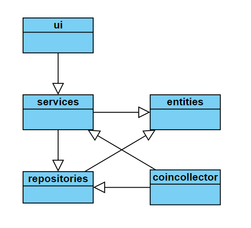

# Arkkitehtuurikuvaus

## Rakenne

Ohjelman rakenne noudattelee kolmitasoista kerrosarkkitehtuuria, ja koodin pakkausrakenne on seuraava:

Pakkaus ui sisältää käyttöliittymästä, services sovelluslogiikasta ja repositories tietojen pysyväistallennuksesta vastaavan koodin. Pakkaus entities sisältää luokan user, joka kuvaa sovelluksen käyttämää käyttäjä tietokohdetta.

## Käyttöliittymä

Käyttöliittymä sisältää neljä erillistä näkymää:

- Kirjautuminen
- Uuden käyttäjän luominen
- Tulostaulu / Pelin aloitus
- Peli

Kolme ensimmäistä ovat toteutettu omana luokaanaan. Pelin pitäisi olla toteutettu luokkana, mutta se on tällä hetkellä voin methodi, jolla on muutama luokaa auttamassa. Kaikki näkymät, paitsi peli, ovat aina yksin näkyvillä. Peli ja tulostaulu ovat samaan aikaa auki. Näkymistä vastaa UI-luokka. Käyttöliittymä on eristetty sovelluslogiikasta. Kutsutaan servicestä methodeja.

## Sovelluslogiikka

Sovelluksen loogisen tietomallin muodostaa luokka User, joka kuvaa käyttäjiä.

Toiminnallisista kokonaisuuksista vastaa luokan Service olio. Luokkalla on käyttöliittymälle käytettäviä methodeja.  
Esimerkiksi:
- login(username, password)
- logout()
- top10_hiscore()

Service käsittelee UserRepository luokkaa, joka vastaa tietojen tallennuksesta, ja main_game methodia, joka on pelin päärunko tällä hetkellä. Luokkien toteutuksen injektoidaan sovelluslogiikalle konstruktorikutsun yhteydessä.

## Tietojen pysyväistallennus

Pakkauksen repositories luokka UserRepository huolehtii tietojen tallentamisesta. UserRepository-luokka käyttää SQLite-tietokantaa.

### Tiedosto

Sovellus tallentaa käyttäjien tiedostoon, joka on juuressa olevassa hakemistossa data, nimeltä data.db.

Käyttäjä tiedot tallentuu siis SQLite-tietokantaa tauluun user, joka alustetaan initialize_database.py-tiedostossa

## Päätoiminnallisuudet

### Käyttäjän kirjaantuminen

Kun kirjautumisnäkymän syötekenttiin kirjoitetaan käyttäjätunnus ja salasana, jonka jälkee klikataan painiketta "Login", etenee sovelluksen kontrolli seuraavasti:

### Uuden käyttäjän luominen

Kun uuden käyttäjän luomisnäkymässä on syötetty käyttäjätunnus, joka ei ole jo käytössä sekä salana, jonka jälkee klikataan painiketta "Create" etenee sovelluksen kontrolli seuraavasti:

### Pelin aloitus

Uuden pelin aloitus painamalla painiketta "Play" klikkaamisen jälkeen sovelluksen kontrolli etenee seuraavasti:

### Muut toiminnaliisuudet

Samalla periaatteella toimii myös muutkin asiat.

## Ohjelman rakenteeseen jääneet heikkoudet

### Käyttöliittymä

Pylint ilmoittaa toistuvuuksissa kahdessa käyttöliittymään kuuluvista luokista.
