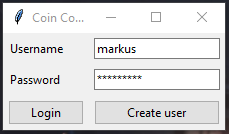
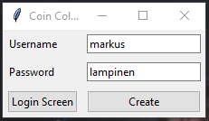
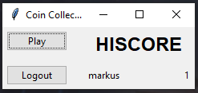
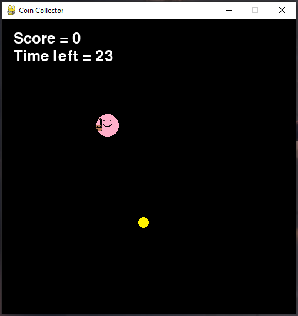

# Käyttöohje

Lataa projektin viimeisimmän [releasen](https://github.com/Sippee/ot-harjoitustyo/releases/tag/latest) lähdekoodi valitsemalla _Assets_-osion alta _Source code_.

## Ohjelman käynnistäminen

Ennen ohjelman käynnistämistä, asenna riippuvuudet komennolla:

```bash
poetry install
```

Jonka jälkeen suorita alustustoimenpiteet komennolla:

```bash
poetry run invoke build
```

Nyt ohjelman voi käynnistää komennolla:

```
poetry run invoke start
```

## Kirjautuminen

Sovellus käynnistyy kirjautumisnäkymään:



Kirjautuminen onnistuu kirjoittamalla olemassaoleva käyttäjätunnus sekä syötekenttään ja painamalla "Login"-painiketta.

## Uuden käyttäjän luominen

Kirjautumisnäkymästä on mahdollista siirtyä uuden käyttäjän luomisnäkymään panikkeella "Create user".

Uusi käyttäjä luodaan syöttämällä tiedot syötekenttiin ja painamalla "Create"-painiketta:



## Kirjautumisen jälkeen

Onnistuneen kirjautumisen myötä päästään näkemään kymmenen parhaan pisteet tai aloittamaan uusi peli.



Tulostaulu näyttää 10 parhaiden pisteiden saaneet, joilla on enemmän kuin 0 pistettä.

Klikkaamalla "Logout" käyttäjä kirjautuu ulos takaisin kirjautumisnäkymään. Klikkaamalla "Play" käyttäjä aloittaa uuden pelin.

## Peli

Pelin aloittaessa aika alkaa kulumaan, ja käyttäjän on tarkoitus liikuttaa hahmoa ja kerätä mahdollisimman monta kolikkoa 30 sekuntissa.



Hahmo saa hieman lisää vauhtia jokaisen kerätyn kolikon jälkeen.

Pelin päätyttyä tulostaulu päivittyy.
