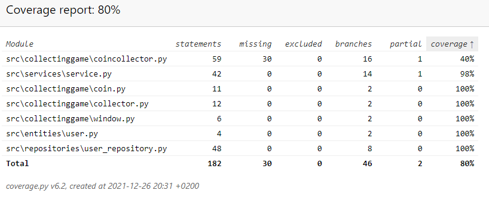

# Testausdokumentti

Ohjelmaa on testattu sekä automatisoiduin yksikkö- ja integraatiotestein unittestilla sekä manuaalisesti tapahtunein järjestelmätason testein.

## Yksikkö- ja integraatiotestaus

### Sovelluslogiikka

Sovelluslogiikasta vastaavaa 'Service'-luokkaa testataan 'TestService'-testiluokalla. `Service`-olio alustetaan, niin että sille injektoidaan riippuvuuksiksi repositorio-olio, joka tallentaa tietoa muistiin pysyväistallennuksen sijaan. Tätä varten testissä on käytössä luokat FakeUserRepository.

### Pelilogiikka

Pelinlogiikasta vastaavat 'Coin'- ja 'Collector'-luokat testataan niille vastaavilla 'TestCoin'- ja 'TestCollector'-luokilla. Pelin refraktoinnin jälkee voisi luoda testiluokan 'TestCoinCollector', ja testata sen avulla pelin logiikkaa.

### Repositorio-luokat

Repositorio-luokka UserRepository testataan tällä hetkellä samalla tiedostolla kuin pää sovellus toimii. UserRepository-luokkaa testataan TestUserRepository-testiluokalla.

### Testauskattavuus

Käyttöliittymäkerrosta lukuunottamatta sovelluksen testauksen haarautumakattavuus on 80%

Itse peli on melko huonosti refraktoitu. Niin se jäi huonosti testatuksi.

## Järjestelmätestaus

Sovelluksen järjestelmätestaus on suoritettu manuaalisesti.

### Asennus

Sovellus on haettu ja sitä on testattu käyttöohjeen kuvaamalla tavalla sekä Windows 10- että Linux-ympäristöön.

### Toiminnallisuudet

Kaikki määrittelydokumentin ja käyttöohjeen listaamat toiminnallisuudet on käyty läpi. Kaikkien toiminnallisuuksien yhteydessä on syötekentät yritetty täyttää myös virheellisillä arvoilla kuten tyhjillä.

## Sovellukseen jääneet laatuongelmat

Pelin logiikka on huonosti refraktoitu, joten sen yksikkötestejä ei vielä saatu tehtyä.

Sovellus ei anna tällä hetkellä järkeviä virheilmoituksia, seuraavissa tilanteissa:

- SQLite tietokantaa ei ole alustettu, eli `python -m poetry run invoke build`-komentoa ei ole suoritettu
